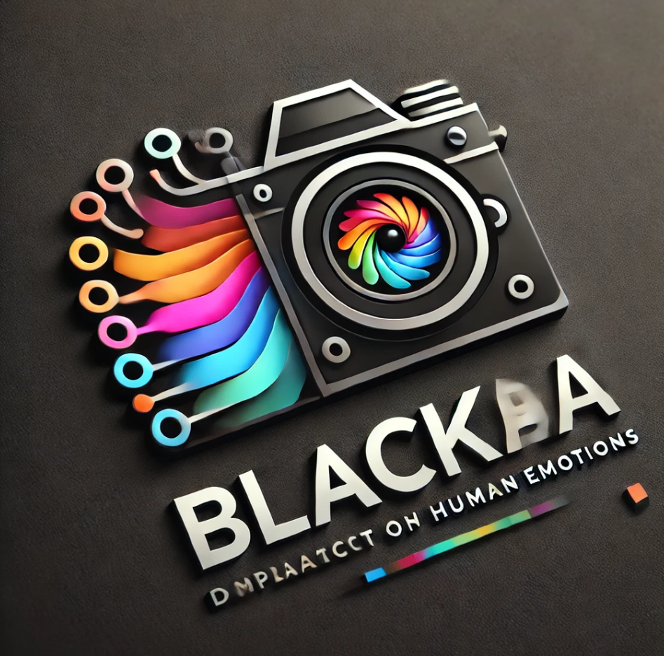

# **BlackAI** https://blackai.carrd.co/

  

## **Exploring the Impact of Color on Human Emotions**

---

### **Executive Summary**

BlackAI is an innovative project leveraging advanced AI technologies and blockchain capabilities to explore and harness the relationship between colors and human emotions. By utilizing the Solana blockchain, we ensure a decentralized, transparent, and efficient system for incentivizing user participation through token rewards. The project aims to establish a data-driven platform that combines cutting-edge AI, mobile technology, and user interaction to create real-world applications in mental health, advertising, and personalized services.

---

### **Vision**

To create a global ecosystem where color-driven emotional insights empower individuals and industries to make more informed decisions, while fostering active user engagement through blockchain incentives.

---

### **Key Features**

1. **AI-Powered Emotion Analysis:**
   - A mobile app integrated with Solana smartphones to capture images and extract color features.
   - Advanced AI models analyze dominant colors and predict corresponding emotional states.

2. **User Engagement & Feedback:**
   - Users provide feedback on their emotions, which refines AI predictions and improves model accuracy.

3. **Blockchain Integration:**
   - Reward users with project-specific tokens for participation, labeled as "Emotion Tokens (ET)."
   - Tokens can be traded, redeemed, or staked within the Solana ecosystem.

4. **Real-World Applications:**
   - Tailored mental health tools for individuals.
   - Insight generation for marketing and advertising strategies.
   - Data-driven personalized services for industries like retail and entertainment.

---

### **Reward Mechanism**

- **Incentive Structure:**
  - Users earn $blackai for contributing high-quality emotion data.
  - Additional rewards for consistent participation and providing feedback that matches the AI model's predictions.

- **Token Utility:**
  - Redeem tokens for discounts on premium app features.
  - Stake tokens for higher reward tiers.
  - Trade tokens within the Solana ecosystem.

- **Gamification:**
  - Leaderboards for top contributors with bonus rewards.
  - Achievements unlock collectible NFTs representing unique emotional spectrums.

---

### **Market Potential**

- **Mental Health Industry:**
  - Global mental health market valued at $383 billion in 2020 with a CAGR of 3.5%.
  - BlackAI offers scalable tools for emotional awareness and management.

- **Advertising & Marketing:**
  - Color psychology has a direct impact on consumer behavior.
  - Data insights can optimize campaigns for improved engagement and ROI.

- **Personalized Retail:**
  - Customization based on emotional analysis enhances customer experience.

---

### **Revenue Model**

1. **Subscription Services:**
   - Freemium model with premium features like advanced analytics and personalized insights.

2. **Tokenomics:**
   - A portion of ET used within the app will be burned, creating deflationary value.

3. **Data Licensing:**
   - Anonymous and aggregated data can be licensed to industries for research and development purposes.

4. **Partnerships:**
   - Collaborations with mental health apps, retail brands, and marketing agencies.

---

### **Technical Architecture**

1. **Mobile App (Frontend):**
   - Built on Solana mobile OS for seamless blockchain integration.
   - Intuitive UI for image capturing and emotion feedback.

2. **Backend:**
   - AI model for emotion prediction deployed on scalable cloud infrastructure.
   - Data encrypted and securely stored on Solana blockchain.

3. **Blockchain Integration:**
   - Smart contracts for token issuance and rewards.
   - Transparent transaction history for users.

---

### **Investment Opportunity**

- **Investor Benefits:**
  - Equity stake in BlackAI.
  - Priority access to project data and insights.
  - Share of revenue from subscription and licensing.

---

### **Team**

- **AI Experts:** Specializing in machine learning and emotion prediction models.
- **Blockchain Developers:** Experienced in Solana smart contracts and tokenomics.
- **Designers & Marketers:** Creating a user-friendly app and driving global adoption.

---

### **Call to Action**

Join us in revolutionizing emotional intelligence through AI and blockchain. Together, we can unlock the untapped potential of color-driven insights while creating a thriving ecosystem powered by Solana.

---
### **CA**
# BlackAI Project Update

## **Multilingual Announcement**

---

### **English Version**

Dear supporters and partners,  

Thank you for your continued support of the **BlackAI** project! We are committed to exploring the relationship between colors and human emotions using artificial intelligence and blockchain technologies.  

Currently, the project is in its **initial phase**, and our primary focus is on:
- Refining the core technical architecture, including emotion analysis models and data processing pipelines.
- Strengthening system stability and scalability.
- Attracting more funding and partners to support the project.  

#### **About the CA (Token Contract)**
Since the project is in its early stages, we believe it is essential to focus on technical improvements and fundraising efforts. Therefore, we have decided to **pause the activation and release of the CA (Token Contract)** until:
- The technical foundation of the project is solid.
- Sufficient funding is secured.
- A clear implementation plan for the token economy is in place.  

This decision will ensure the long-term success of the project and deliver real value to all participants when the token economy is launched.  

**Future Plans**:
- Focus on core technology development.  
- Actively seek funding to kick off the next phase of testing and promotion.  
- Regularly update progress to maintain transparency.  

Thank you for your understanding and support!  

Best regards,  
**The BlackAI Team**  

---

### **中文版本**

親愛的支持者與合作夥伴：  

感謝您對 **BlackAI** 項目的持續支持！我們致力於通過人工智慧與區塊鏈技術探索色彩與人類情緒的關係。  

目前，項目處於 **初始階段**，我們的主要重點是：  
- 完善核心技術架構，包括情緒分析模型和數據處理管道。  
- 加強系統的穩定性與可擴展性。  
- 吸引更多資金與合作夥伴，為項目提供支持。  

#### **關於 CA（代幣合約）**  
由於項目尚處於早期階段，我們認為目前應專注於技術改進和資金籌集。因此，我們決定 **暫停啟動和發佈 CA（代幣合約）**，直至：  
- 項目的技術基礎更加穩固。  
- 吸引到足夠的啟動資金。  
- 為代幣經濟模型提供清晰的實施方案。  

這一決策將有助於項目的長期成功，並確保在啟動代幣經濟時為所有參與者帶來真正的價值。  

**未來計劃**：  
- 繼續專注於核心技術開發。  
- 積極尋求資金支持，啟動下一階段的測試與市場推廣。  
- 定期更新項目進展，保持透明度。  

感謝您的理解與支持！  

**BlackAI 團隊**  

---

### **Español**  

Estimados patrocinadores y socios:  

¡Gracias por su continuo apoyo al proyecto **BlackAI**! Estamos comprometidos a explorar la relación entre los colores y las emociones humanas mediante tecnologías de inteligencia artificial y blockchain.  

Actualmente, el proyecto se encuentra en su **fase inicial**, y nuestro enfoque principal está en:  
- Refinar la arquitectura técnica central, incluidos los modelos de análisis de emociones y los procesos de datos.  
- Mejorar la estabilidad y escalabilidad del sistema.  
- Atraer más financiamiento y socios para respaldar el proyecto.  

#### **Sobre el CA (Contrato de Tokens)**  
Dado que el proyecto está en una etapa temprana, creemos que es fundamental centrarse en las mejoras técnicas y los esfuerzos de recaudación de fondos. Por lo tanto, hemos decidido **pausar la activación y el lanzamiento del CA (Contrato de Tokens)** hasta que:  
- La base técnica del proyecto sea sólida.  
- Se asegure un financiamiento suficiente.  
- Exista un plan claro para implementar la economía de tokens.  

Esta decisión garantizará el éxito a largo plazo del proyecto y brindará valor real a todos los participantes cuando se lance la economía de tokens.  

**Planes Futuros**:  
- Centrarnos en el desarrollo de la tecnología principal.  
- Buscar activamente financiamiento para iniciar la próxima fase de pruebas y promoción.  
- Actualizar regularmente los avances para mantener la transparencia.  

¡Gracias por su comprensión y apoyo!  

Atentamente,  
**El Equipo de BlackAI**  

---

### **हिंदी (Hindi)**

प्रिय समर्थकों और भागीदारों,  

**BlackAI** परियोजना के प्रति आपके निरंतर समर्थन के लिए धन्यवाद! हम कृत्रिम बुद्धिमत्ता और ब्लॉकचेन तकनीकों का उपयोग करके रंगों और मानव भावनाओं के बीच संबंधों की खोज के लिए प्रतिबद्ध हैं।  

वर्तमान में, परियोजना अपने **प्रारंभिक चरण** में है, और हमारा प्राथमिक ध्यान है:  
- मुख्य तकनीकी वास्तुकला को परिष्कृत करना, जिसमें भावना विश्लेषण मॉडल और डेटा प्रोसेसिंग पाइपलाइन शामिल हैं।  
- सिस्टम की स्थिरता और स्केलेबिलिटी को मजबूत करना।  
- परियोजना को समर्थन देने के लिए अधिक धन और भागीदारों को आकर्षित करना।  

#### **CA (टोकन अनुबंध) के बारे में**  
चूंकि परियोजना प्रारंभिक चरण में है, इसलिए हमारा मानना है कि तकनीकी सुधारों और धन उगाहने के प्रयासों पर ध्यान केंद्रित करना आवश्यक है। इसलिए, हमने **CA (टोकन अनुबंध) की सक्रियता और रिलीज़ को रोकने का निर्णय लिया है** जब तक कि:  
- परियोजना की तकनीकी नींव ठोस न हो।  
- पर्याप्त धन सुरक्षित हो।  
- टोकन अर्थव्यवस्था के लिए एक स्पष्ट कार्यान्वयन योजना मौजूद हो।  

यह निर्णय परियोजना की दीर्घकालिक सफलता सुनिश्चित करेगा और टोकन अर्थव्यवस्था के लॉन्च के समय सभी प्रतिभागियों को वास्तविक मूल्य प्रदान करेगा।  

**भविष्य की योजनाएं**:  
- मुख्य प्रौद्योगिकी विकास पर ध्यान केंद्रित करना।  
- परीक्षण और प्रचार के अगले चरण को शुरू करने के लिए सक्रिय रूप से धन प्राप्त करना।  
- पारदर्शिता बनाए रखने के लिए नियमित रूप से प्रगति को अपडेट करना।  

आपके समझ और समर्थन के लिए धन्यवाद!  

सादर,  
**BlackAI टीम**  

